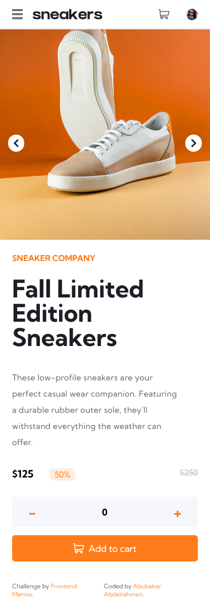

# Frontend Mentor - E-commerce product page solution

This is a solution to the [E-commerce product page challenge on Frontend Mentor](https://www.frontendmentor.io/challenges/ecommerce-product-page-UPsZ9MJp6). Frontend Mentor challenges help you improve your coding skills by building realistic projects.

## Table of contents

- [Overview](#overview)
  - [The challenge](#the-challenge)
  - [Screenshot](#screenshot)
  - [Links](#links)
- [My process](#my-process)
  - [Built with](#built-with)
  - [What I learned](#what-i-learned)
  - [Continued development](#continued-development)
- [Author](#author)

## Overview

### The challenge

Users should be able to:

- View the optimal layout for the site depending on their device's screen size
- See hover states for all interactive elements on the page
- Open a lightbox gallery by clicking on the large product image
- Switch the large product image by clicking on the small thumbnail images
- Add items to the cart
- View the cart and remove items from it

### Screenshot

### Links

- Solution URL: [GitHub](https://github.com/AbubakerCodes/ecommerce_product_page)
- Live Site URL: [eCommerce product page](https://ecomm-product-page.vercel.app)

## My process

### Built with

- HTML5, CSS3, ES6+
- Mobile-first workflow
- [React](https://reactjs.org/) - JS library
- [TailwindCSS](https://tailwindcss.com/) - CSS library

### What I learned

- Effective use of React for building interactive user interfaces.
- Leveraging the useContext hook for state management.
- Enhancing skills in responsive design principles.

## Author

- LinkedIn - [AbubakerCodes](https://www.linkedin.com/in/AbubakerCodes)
- Frontend Mentor - [AbubakerCodes](https://www.frontendmentor.io/profile/AbubakerCodes)

